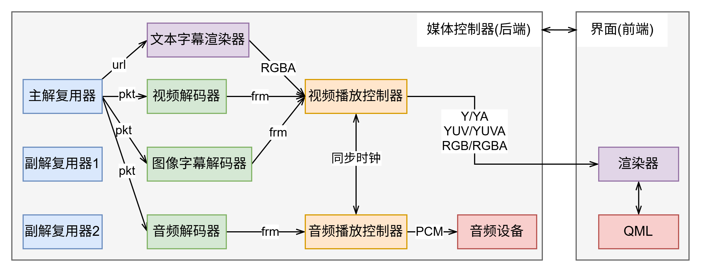

# AZPlayer

使用[Qt](https://www.qt.io/)开发的基于[FFmpeg](https://www.ffmpeg.org/)的音视频播放器。支持主流音视频格式、图形字幕、ASS与SRT字幕的播放。支持对显示图像进行旋转、缩放、移动、镜像操作。支持音频流与字幕流的切换，以及从外部文件导入音频流或字幕流。

## 界面/使用
界面风格参考[Potplayer](https://potplayer.daum.net/)，[功能演示](https://www.bilibili.com/video/BV11M1mBHEMC)


## 功能 / 可能的开发计划

- [x] 音频、视频、音视频播放
- [x] 开始/暂停、跳转、快退、快进、上一个、下一个、音量调节
- [x] 窗口大小位置调节、最大化、最小化、全屏
- [x] 播放图形字幕
- [x] 播放列表、播完重播、列表顺序播放，列表随机播放
- [x] 字幕流、音频流切换
- [x] 从外部文件加载字幕流、音频流
- [x] 对显示画面进行旋转、缩放、移动、镜像操作
- [x] 播放文本字幕(已支持ASS、SRT字幕)
- [x] 章节显示与跳转
- [x] 拖拽文件文件夹启动时自动加载并播放
- [ ] 倍速
- [ ] 截图
- [ ] 单帧播放
- [ ] 区间循环播放
- [ ] 音频流、字幕流偏移（提前或者延后播放）
- [ ] 加载B站弹幕
- [ ] 硬解
- [ ] 拖动文件文件夹到界面后自动播放并添加到列表
- [ ] 处理不同音频设备切换

## 下载

目前仅支持Windows平台，可以通过本页面的[Releases](https://github.com/az7792/AZPlayer/releases)选项卡进行下载，下载解压后运行appAZPlayer.exe启动程序

## 编译

1. 准备环境：Qt 6.6.3（可能需要额外安装Multimedia模块）， CMake 3.16， [FFmpeg 8.0](https://www.gyan.dev/ffmpeg/builds/), MinGW / MSVC
2. 修改CMakeLists.txt，需要修改 `FFMPEG_DIR` 指向本地自己准备的FFmpeg发行包路径，还需要修改`libass`的路径，可以从[libass](https://github.com/az7792/AZPlayer/releases/tag/v0.1.0-beta.1)下载或者自己准备，确保 bin/lib/include 完整，并检查动态链接库版本是否一致，若不一致需要根据实际情况进行修改

```cmake
...

# 在这儿设置你自己的 FFmpeg 路径
set(FFMPEG_DIR D:/ffmpeg-8.0-full_build-shared)
set(FFMPEG_INCLUDE_DIR ${FFMPEG_DIR}/include)
set(FFMPEG_LIB_DIR ${FFMPEG_DIR}/lib)
set(FFMPEG_BIN_DIR ${FFMPEG_DIR}/bin)
# 在这儿设置 libass 路径，可以直接放项目根目录下
set(ASS_DIR ${CMAKE_CURRENT_SOURCE_DIR}/libass)
set(ASS_INCLUDE_DIR ${ASS_DIR}/include)
set(ASS_LIB_DIR ${ASS_DIR}/lib)
set(ASS_BIN_DIR ${ASS_DIR}/bin)

...

# 在这儿设置FFmpeg 和 libass及其依赖 的动态链接库
add_custom_command(TARGET appAZPlayer POST_BUILD
        COMMAND ${CMAKE_COMMAND} -E copy_if_different
            ${FFMPEG_BIN_DIR}/avutil-60.dll
            ${FFMPEG_BIN_DIR}/avcodec-62.dll
            ${FFMPEG_BIN_DIR}/avformat-62.dll
            ${FFMPEG_BIN_DIR}/swscale-9.dll
            ${FFMPEG_BIN_DIR}/swresample-6.dll
            ${ASS_BIN_DIR}/ass.dll
            ${ASS_BIN_DIR}/brotlicommon.dll
            ${ASS_BIN_DIR}/brotlidec.dll
            ${ASS_BIN_DIR}/brotlienc.dll
            ${ASS_BIN_DIR}/bz2.dll
            ${ASS_BIN_DIR}/freetype.dll
            ${ASS_BIN_DIR}/fribidi-0.dll
            ${ASS_BIN_DIR}/harfbuzz-subset.dll
            ${ASS_BIN_DIR}/harfbuzz.dll
            ${ASS_BIN_DIR}/libpng16.dll
            ${ASS_BIN_DIR}/zlib1.dll
            $<TARGET_FILE_DIR:appAZPlayer>        
        COMMAND ${CMAKE_COMMAND} -E copy_directory
            ${CMAKE_CURRENT_SOURCE_DIR}/LICENSES
            $<TARGET_FILE_DIR:appAZPlayer>/LICENSES
        COMMENT "拷贝DLL和LICENSES"
    )    
    
...
```

## 打包发布

1. 首先使用 `release` 模式编译一遍程序
2. 将 `release.ps1` 脚本中的4个常量根据实际情况改成你自己的
```
# [常量1] 编译后的可执行文件路径
$ExeSourcePath = ".\out\build\release\appAZPlayer.exe"

# [常量2] libass/bin 的文件夹路径
$LibAssBinPath = ".\libass\bin"

# [常量3] ffmpeg/bin 的文件夹路径
$FfmpegBinPath = "D:\ffmpeg-8.0-full_build-shared\bin"

# [常量4] windeployqt.exe 所在路径
# !!! 提示：请确保此工具与编译主程序时使用的套件一致 (如均为 MinGW 或均为 MSVC)
$WindeployqtPath = "D:\Qt\6.6.3\msvc2019_64\bin\windeployqt.exe"
```
3. 执行该脚本
4. 脚本执行完成后程序会被打包到当前文件夹下的 `release` 文件夹里

## 文件/程序结构

```
.
│  CMakeLists.txt
│  main.cpp
│  qml.qrc
│  resource.qrc
├─utils # 工具
├─clock # 时钟
├─demux # 解复用器
├─decode # 音、视频、字幕解码器
├─renderer # 音频、视频播放控制器（控制数据输出节奏），以及音频播放设备、文本字幕渲染器和视频画面渲染器
├─controller # 管理整个后端并向前端提供接口
├─qml # 前端UI
├─docs
└─resource
    ├─icon # 图标
    └─shaderSource # OpenGL的顶点着色器和片段着色器
```



> 其中两个副解复用器用于从外部加载音频和字幕
> 文本字幕是一次性加载的，后续帧数据全部由文本字幕渲染器提供

## 图标

本项目图标来自[material-design-icons](https://fonts.google.com/icons)

## LICENSE

本项目基于 GNU 通用公共许可证第 3 版（GPL-3.0）授权
