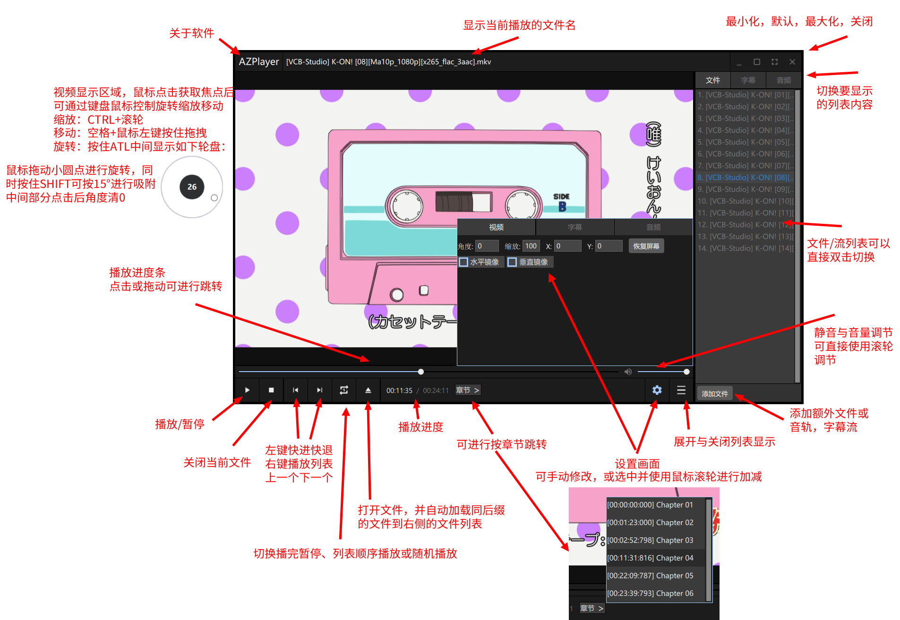
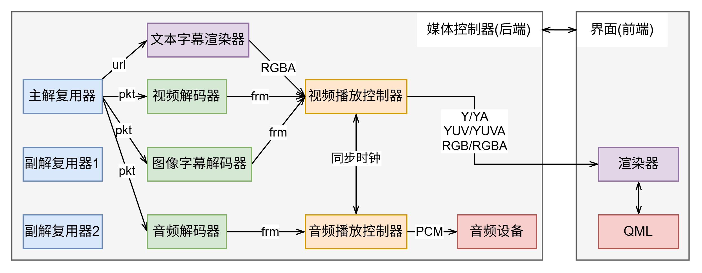

# AZPlayer

使用[Qt](https://www.qt.io/)开发的基于[FFmpeg](https://www.ffmpeg.org/)的音视频播放器。支持主流音视频格式、图形字幕、ASS与SRT字幕的播放。支持对显示图像进行旋转、缩放、移动、镜像操作。支持音频流与字幕流的切换，以及从外部文件导入音频流或字幕流。

## 界面/使用
界面风格参考[Potplayer](https://potplayer.daum.net/)，[功能演示](https://www.bilibili.com/video/BV11M1mBHEMC)


## 功能 / 可能的开发计划

- [x] 音频、视频、音视频播放
- [x] 开始/暂停、跳转、快退、快进、上一个、下一个、音量调节
- [x] 窗口大小位置调节、最大化、最小化、全屏
- [x] 播放图形字幕
- [x] 播放列表、播完重播、列表顺序播放，列表随机播放
- [x] 字幕流、音频流切换
- [x] 从外部文件加载字幕流、音频流
- [x] 对显示画面进行旋转、缩放、移动、镜像操作
- [x] 播放文本字幕(已支持ASS、SRT字幕)
- [x] 章节显示与跳转
- [x] 拖拽文件文件夹启动时自动加载并播放
- [x] 音频设备跟随系统自动切换
- [ ] 倍速
- [ ] 截图
- [ ] 单帧播放
- [ ] 区间循环播放
- [ ] 音频流、字幕流偏移（提前或者延后播放）
- [ ] 加载B站弹幕
- [ ] 硬解
- [ ] 拖动文件文件夹到界面后自动播放并添加到列表

## 下载

目前仅支持Windows平台，可以通过本页面的[Releases](https://github.com/az7792/AZPlayer/releases)选项卡进行下载，下载后运行安装程序进行安装。

## 编译

1. 准备环境：Qt 6.6.3， CMake 3.16， [FFmpeg 8.0](https://www.gyan.dev/ffmpeg/builds/), MinGW / MSVC
2. 复制 `./config/env.json.example` 并重命名为 `env.json`。
3. 修改 `env.json`，根据实际情况配置以下路径：

```json
{
    "FFMPEG_DIR": "D:/ffmpeg-8.0-full_build-shared",
    "ASS_DIR": "D:/QTproject/AZPlayer/3rd/libass",
    "WINDEPLOYQT_EXE": "D:/Qt/6.6.3/msvc2019_64/bin/windeployqt.exe",
    "TARGET_EXE_PATH": "./out/build/release/appAZPlayer.exe"
}
```

配置项说明：
- `FFMPEG_DIR`: FFmpeg SDK 的根目录路径（需包含 include、lib、bin 子目录）
- `ASS_DIR`: libass SDK 的根目录路径（需包含 include、lib、bin 子目录）
- `WINDEPLOYQT_EXE`: 用于发布打包程序的 Qt 部署工具的完整路径，请确保此工具与编译主程序时使用的套件一致 (如均为 MinGW 或均为 MSVC)
- `TARGET_EXE_PATH`: 编译后的可执行文件路径

> **注意：路径请使用 '/' 而不是 '\\'**  
> `TARGET_EXE_PATH`可使用相对(相对于项目根目录)或绝对路径，其他配置项请使用绝对路径

## 打包发布

1. 首先使用 `release` 模式编译一遍程序
2. 确保 `config/env.json` 中的配置正确
3. 执行 `release.ps1` 脚本
4. 脚本执行完成后程序会被打包到当前文件夹下的 `release` 文件夹里

## 文件/程序结构

```
.
│  CMakeLists.txt
│  main.cpp
│  qml.qrc
│  resource.qrc
├─utils # 工具
├─clock # 时钟
├─demux # 解复用器
├─decode # 音、视频、字幕解码器
├─renderer # 音频、视频播放控制器（控制数据输出节奏），以及音频播放设备、文本字幕渲染器和视频画面渲染器
├─controller # 管理整个后端并向前端提供接口
├─qml # 前端UI
├─docs
└─resource
    ├─icon # 图标
    └─shaderSource # OpenGL的顶点着色器和片段着色器
```



> 其中两个副解复用器用于从外部加载音频和字幕  
> 文本字幕是一次性加载的，后续帧数据全部由文本字幕渲染器提供

## 图标

本项目图标来自[material-design-icons](https://fonts.google.com/icons)

## LICENSE

本项目基于 GNU 通用公共许可证第 3 版（GPL-3.0）授权
