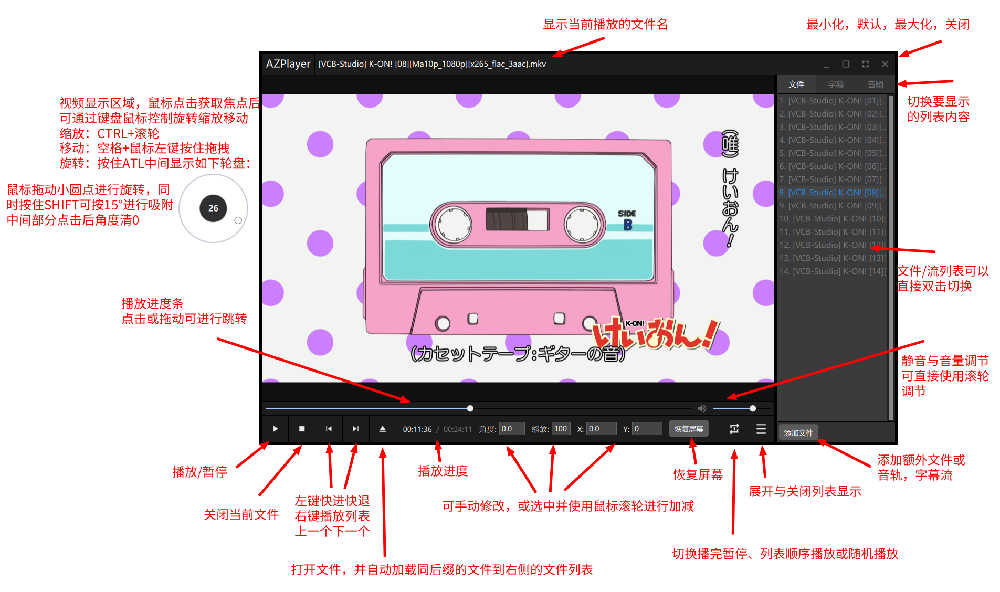

# AZPlayer

使用[Qt](https://www.qt.io/)开发的基于[FFmpeg](https://www.ffmpeg.org/)的音视频播放器。支持绝大多数的音频、视频、图形字幕的播放。支持对显示图像进行旋转、缩放、移动操作。支持音频流与字幕流的切换，以及从外部文件导入音频流或字幕流。

## 界面/使用
界面风格参考[Potplayer](https://potplayer.daum.net/)


## 功能 / 可能的开发计划

- [x] 音频、视频、音视频播放
- [x] 开始/暂停、跳转、快退、快进、上一个、下一个、音量调节
- [x] 窗口大小位置调节、最大化、最小化、全屏
- [x] 播放图形字幕（不能单独播放需要配合视频）
- [x] 播放列表、播完重播、列表顺序播放，列表随机播放
- [x] 字幕流、音频流切换
- [x] 从外部文件加载字幕流、音频流
- [x] 对显示画面进行旋转、缩放、移动操作
- [ ] 播放文本字幕
- [ ] 章节显示
- [ ] 倍速
- [ ] 截图
- [ ] 镜像
- [ ] 单帧播放
- [ ] 区间循环播放
- [ ] 音频流、字幕流偏移（提前或者延后播放）
- [ ] 加载B站弹幕
- [ ] 硬解

## 下载

目前仅支持Windows平台，可以通过本页面的[Releases](https://github.com/az7792/AZPlayer/releases)选项卡进行下载，下载解压后运行appAZPlayer.exe启动程序

## 编译

1. 准备环境：Qt 6.6.3（可能需要额外安装Multimedia模块）， CMake 3.16， [FFmpeg 8.0](https://www.gyan.dev/ffmpeg/builds/), MinGW / MSVC
2. 修改CMakeLists.txt，需要修改 `FFMPEG_DIR` 指向本地自己准备的FFmpeg发行包路径，确保 bin/lib/include 完整，并检查动态链接库版本是否一致，若不一致需要根据实际情况进行修改

```cmake
...

# 在这儿设置你自己的 FFmpeg 路径
set(FFMPEG_DIR D:/ffmpeg-8.0-full_build-shared)
set(FFMPEG_INCLUDE_DIR ${FFMPEG_DIR}/include)
set(FFMPEG_LIB_DIR ${FFMPEG_DIR}/lib)
set(FFMPEG_BIN_DIR ${FFMPEG_DIR}/bin)

...

# 在这儿设置FFmpeg 的动态链接库（注意版本是否一致）
add_custom_command(TARGET appAZPlayer POST_BUILD
        COMMAND ${CMAKE_COMMAND} -E copy_if_different
            ${FFMPEG_BIN_DIR}/avutil-60.dll
            ${FFMPEG_BIN_DIR}/avcodec-62.dll
            ${FFMPEG_BIN_DIR}/avformat-62.dll
            ${FFMPEG_BIN_DIR}/avdevice-62.dll
            ${FFMPEG_BIN_DIR}/avfilter-11.dll
            ${FFMPEG_BIN_DIR}/swscale-9.dll
            ${FFMPEG_BIN_DIR}/swresample-6.dll
            $<TARGET_FILE_DIR:appAZPlayer>
        COMMENT "Copying FFmpeg DLLs to output directory"
    )
    
...
```

## 文件结构

```
.
│  CMakeLists.txt
│  main.cpp
│  qml.qrc
│  resource.qrc
│  utils.h 
├─clock # 时钟
├─demux # 解复用器
├─decode # 音、视频、字幕解码器
├─renderer # 音频、视频播放控制器（控制数据输出节奏），以及音频播放设备和视频画面渲染器
├─controller # 管理整个后端并向前端提供接口
├─qml # 前端UI
├─docs
└─resource
    ├─icon # 图标
    └─shaderSource # OpenGL的顶点着色器和片段着色器
```

## 图标

本项目图标来自[material-design-icons](https://fonts.google.com/icons)

## LICENSE

本项目基于 GNU 通用公共许可证第 3 版（GPL-3.0）授权
